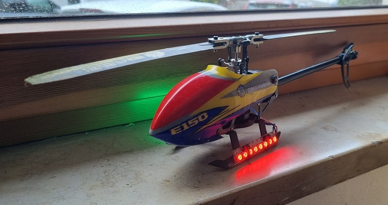
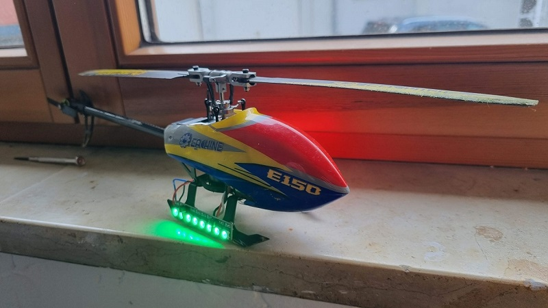

# Positioning lights

Small sketch to use WS2812 or similar leds as postion lights on helis, other actually everything

Base idea:

- Left side: red
- Right side: green
- Back: "flashing"

Offcause there are many ways to extend this with landing lights, input switches from reciever controlled ... but i only needed this

## Hardware

AZ-Delivery ATTiny85 - Rev3 or any other board that runs arduino skatches.
I picked this one as in supports laziness. You can get an ATTiny even as a solo chip but then you have to add programming, voltage stuff etc.

Solution tiny chip on a small board that has an usb stick included.

I grab the 12 V from an 3s lipo and direcly supply the 2 8 pixel strips in a row with it.

Use some double sided tape to stick in anywhere (don't have carbon plates on the back as they creates short cuts).

Cabletie the rest to what ever and have fun.

## Final

